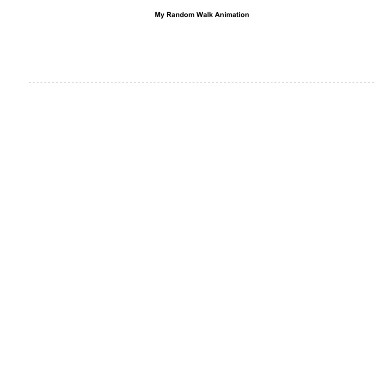

```{r}
random.walk <- cumsum(rnorm(100))
  
plot( random.walk, type="l", col="darkred", axes=F, xlab="", ylab="", main="Random Walk" )
abline( h=0, lty=2, col="gray" )
```

```{r}
# create a directory for your images

dir.create("gifs")
setwd("gifs")

library( animation )

min.y = min(random.walk)
max.y = max(random.walk)
saveGIF({

  
 for (i in 1:100){
   plot(random.walk[1:i], type = "l", col = "darkred", axes = F, xlab = "", ylab = "", main = "My Random Walk Animation", xlim = c(0, 100), ylim = c(min.y, max.y))
   abline(h = 0, lty = 2, col = "gray")
 }
}, 
                     # name of your gif
interval = 0.1,                  # controls the animation speed
ani.width = 800,                 # size of the gif in pixels
ani.height = 800
)              


```

