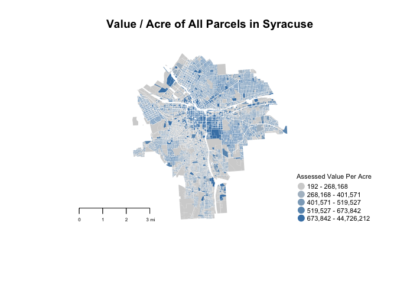
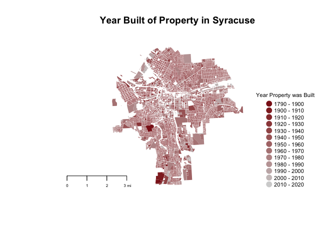

Lab04
================
Chris Davis
2/9/2017

``` r
setwd("~/Desktop/DDMII/Lab02/shapefiles")
library( rgdal )
```

    ## Warning: package 'rgdal' was built under R version 3.3.2

    ## Loading required package: sp

    ## rgdal: version: 1.2-5, (SVN revision 648)
    ##  Geospatial Data Abstraction Library extensions to R successfully loaded
    ##  Loaded GDAL runtime: GDAL 2.1.2, released 2016/10/24
    ##  Path to GDAL shared files: 
    ##  Loaded PROJ.4 runtime: Rel. 4.9.1, 04 March 2015, [PJ_VERSION: 491]
    ##  Path to PROJ.4 shared files: (autodetected)
    ## WARNING: no proj_defs.dat in PROJ.4 shared files
    ##  Linking to sp version: 1.2-3

``` r
library( maptools )
```

    ## Warning: package 'maptools' was built under R version 3.3.2

    ## Checking rgeos availability: TRUE

``` r
library( geojsonio )
```

    ## Warning: package 'geojsonio' was built under R version 3.3.2

    ## 
    ## Attaching package: 'geojsonio'

    ## The following object is masked from 'package:base':
    ## 
    ##     pretty

``` r
library(dplyr)
```

    ## 
    ## Attaching package: 'dplyr'

    ## The following objects are masked from 'package:stats':
    ## 
    ##     filter, lag

    ## The following objects are masked from 'package:base':
    ## 
    ##     intersect, setdiff, setequal, union

``` r
library(RColorBrewer)
library(maps)

syr <- readOGR(dsn = "syr_parcels.geojson")
```

    ## OGR data source with driver: GeoJSON 
    ## Source: "syr_parcels.geojson", layer: "OGRGeoJSON"
    ## with 41502 features
    ## It has 64 fields

    ## NOTE: rgdal::checkCRSArgs: no proj_defs.dat in PROJ.4 shared files

``` r
proj4string( syr )
```

    ## [1] "+proj=longlat +datum=WGS84 +no_defs +ellps=WGS84 +towgs84=0,0,0"

``` r
syr <- spTransform( syr, CRS("+proj=longlat +datum=WGS84") )
```

    ## NOTE: rgdal::checkCRSArgs: no proj_defs.dat in PROJ.4 shared files

``` r
proj4string( syr )
```

    ## [1] "+proj=longlat +datum=WGS84 +ellps=WGS84 +towgs84=0,0,0"

``` r
dat <- as.data.frame(syr)
```

Question 1: How many single family homes are in each neighborhood?

• Create a table of the count of single family homes by neighborhood

``` r
dat<- tbl_df(dat)
singles <- filter(dat, LandUse == "Single Family")
datGrouped <- group_by(singles, Nhood)
summarize(datGrouped, total = n())
```

    ## # A tibble: 31 × 2
    ##             Nhood total
    ##            <fctr> <int>
    ## 1        Brighton  1398
    ## 2  Court-Woodlawn  1859
    ## 3        Downtown     1
    ## 4        Eastwood  3605
    ## 5         Elmwood   909
    ## 6    Far Westside   471
    ## 7    Hawley-Green    52
    ## 8       Lakefront    24
    ## 9    Lincoln Hill   580
    ## 10    Meadowbrook  1721
    ## # ... with 21 more rows

• Highlight all single family homes, using a different color for each neighborhood

``` r
mySingles <- syr[syr$LandUse == "Single Family", ]
notSingles <- syr[syr$LandUse != "Single Family", ]

plot(notSingles, col = "grey", border = "grey", main = "Single Family Houses by Neighborhood")


myPallete <- c(brewer.pal(12, "Set3"), brewer.pal(9, "Set1"), brewer.pal(12, "Paired"))

palette(myPallete)

plot(mySingles, col = as.factor(mySingles$Nhood), border = as.factor(mySingles$Nhood), add = T)
legend( "bottomright", bg="white",
        pch=19, pt.cex=.5, cex=.35,
        legend=levels(mySingles$Nhood), 
        col=palette(), 
        box.col="white",
        title="Single Family Houses by Neighborhood" 
       )
```


Question 2: Where does land in Syracuse have the highest value?

• Create a table of the count of single family homes with values above $200k in each neighborhood, as a pecentage of all single family homes

``` r
 myTable <- summarize(datGrouped, total = n(), homesAbove200 = round(sum(AssessedVa > 200000)/nrow(mySingles)*100, digits = 3))

myTable <- arrange(myTable, desc(homesAbove200))

myTable$homesAbove200 <- paste(myTable$homesAbove200, "%", sep = "")

print(myTable, n = 31)
```

    ## # A tibble: 31 × 3
    ##                      Nhood total homesAbove200
    ##                     <fctr> <int>         <chr>
    ## 1                 Sedgwick   892        0.533%
    ## 2              Meadowbrook  1721        0.246%
    ## 3  University Neighborhood   803         0.07%
    ## 4               Strathmore  1475        0.066%
    ## 5                Winkworth   411        0.045%
    ## 6             Lincoln Hill   580        0.029%
    ## 7             South Valley  1605         0.02%
    ## 8           Outer Comstock   697        0.012%
    ## 9                Northside  1508        0.008%
    ## 10                Eastwood  3605        0.004%
    ## 11         University Hill    17        0.004%
    ## 12                Brighton  1398            0%
    ## 13          Court-Woodlawn  1859            0%
    ## 14                Downtown     1            0%
    ## 15                 Elmwood   909            0%
    ## 16            Far Westside   471            0%
    ## 17            Hawley-Green    52            0%
    ## 18               Lakefront    24            0%
    ## 19           Near Eastside    93            0%
    ## 20           Near Westside   521            0%
    ## 21            North Valley  1194            0%
    ## 22               Park Ave.   167            0%
    ## 23           Prospect Hill    29            0%
    ## 24            Salt Springs  1029            0%
    ## 25              Skunk City   345            0%
    ## 26            South Campus    25            0%
    ## 27               Southside   481            0%
    ## 28               Southwest   419            0%
    ## 29               Tipp Hill   785            0%
    ## 30       Washington Square   425            0%
    ## 31                Westcott   851            0%

• Plot the value / acre of all parcels in Syracuse

``` r
color.function <- colorRampPalette(c("light gray", "steel blue")) 
col.ramp <- color.function( 5 ) # number of groups you desire

color.vector <- cut(rank(dat$AssessedVa/dat$Acres), breaks=5, labels=col.ramp )

color.vector <- as.character( color.vector )

plot(syr, col=color.vector, border = F, main = "Value / Acre of All Parcels in Syracuse")

map.scale( metric=F, ratio=F, relwidth = 0.15, cex=0.5 )


legend( "bottomright", bg="white",
        pch=19, pt.cex=1.5, cex=0.7,
        legend = c("192 - 268,168", "268,168 - 401,571", "401,571 - 519,527", "519,527 - 673,842", "673,842 - 44,726,212"),
        col=col.ramp, 
        box.col="white",
        title="Assessed Value Per Acre" 
       )
```



Question 3: What is the age of single family homes in each neighborhood?

• Create a table that reports the 10th, 25th, 50th, 75th, and 90th percentile of home ages in each neighborhood.

``` r
dat <- mutate(dat, age =2017 - as.numeric(as.character(YearBuilt)))
singles <- filter(dat, LandUse == "Single Family")
datGrouped <- group_by(singles, Nhood)
 myTable <- summarize(datGrouped, 
         tenth = quantile(age, .1, na.rm = T),
         twentyFifth = quantile(age, .25, na.rm = T), 
         fiftyth = quantile(age, .5, na.rm = T),
         seventyFifth = quantile(age, .75, na.rm = T),
         ninetyth = quantile(age, .9, na.rm = T))
 options(tibble.width = Inf)
 myTable <- arrange(myTable, tenth)
 print(myTable, n = 45)
```

    ## # A tibble: 31 × 6
    ##                      Nhood tenth twentyFifth fiftyth seventyFifth ninetyth
    ##                     <fctr> <dbl>       <dbl>   <dbl>        <dbl>    <dbl>
    ## 1                Southwest  16.5       24.00      87          107    117.0
    ## 2            Near Westside  16.5       28.00      97          117    136.4
    ## 3                Southside  24.0       87.00      97          116    117.0
    ## 4             South Campus  30.8       52.00      60           71     89.0
    ## 5             Lincoln Hill  32.0       87.00      97          117    127.0
    ## 6                Winkworth  46.0       57.00      62           69     87.0
    ## 7           Outer Comstock  52.0       58.00      67           76     92.0
    ## 8             South Valley  54.0       62.00      67           87     97.0
    ## 9             Salt Springs  55.0       62.00      77           89     97.0
    ## 10              Skunk City  55.7       87.00      97          117    127.0
    ## 11             Meadowbrook  57.0       62.00      67           85     91.0
    ## 12            North Valley  57.0       62.00      82           92    105.0
    ## 13              Strathmore  61.0       81.00      91           97    109.0
    ## 14                 Elmwood  61.3       82.00      89           97    117.0
    ## 15                Brighton  62.0       87.00      97          107    117.0
    ## 16                Eastwood  62.0       74.00      87           97    102.0
    ## 17                Westcott  62.0       82.00      92          100    117.0
    ## 18          Court-Woodlawn  64.0       74.00      88           97    117.0
    ## 19                Sedgwick  64.0       73.75      87           95    107.0
    ## 20 University Neighborhood  65.0       71.00      89           97    107.0
    ## 21         University Hill  73.0       87.00      97          107    114.0
    ## 22           Near Eastside  74.1       82.00      97          112    127.0
    ## 23           Prospect Hill  75.0       87.00      97          117    130.0
    ## 24               Tipp Hill  77.9       92.00     107          117    127.0
    ## 25            Far Westside  87.0       97.00     107          117    127.0
    ## 26               Northside  87.0       97.00     107          117    127.0
    ## 27               Park Ave.  87.0       97.00     107          117    127.0
    ## 28       Washington Square  87.0       97.00     117          137    157.0
    ## 29            Hawley-Green  88.0      107.00     117          127    146.1
    ## 30               Lakefront  88.6       97.00     112          127    137.0
    ## 31                Downtown  89.0       89.00      89           89     89.0

• Create a choropleth map that shows the age of properties by decade, pre-1900s can be one category.

``` r
years <- as.numeric(as.character(dat$YearBuilt))

color.function <- colorRampPalette( c("firebrick4", "light gray" ) ) 

col.ramp <- color.function( 13 )

myAges <- cut(years, breaks = c(1790, seq(from = 1900, to = 2020, by = 10)), dig.lab = 10, labels = col.ramp)

plot(syr, col = as.character(myAges), border = F, main = "Year Built of Property in Syracuse")

map.scale( metric=F, ratio=F, relwidth = 0.15, cex=0.5 )

legend("bottomright", bg="white",
        pch=19, pt.cex=1.5, cex=0.7,
        legend = paste(c(1790, seq(from = 1900, to = 2010, by = 10)), "-", seq(from = 1900, to = 2020, by = 10),sep = " "),
        col=col.ramp, 
        box.col="white",
        title="Year Property was Built" 
       )
```


